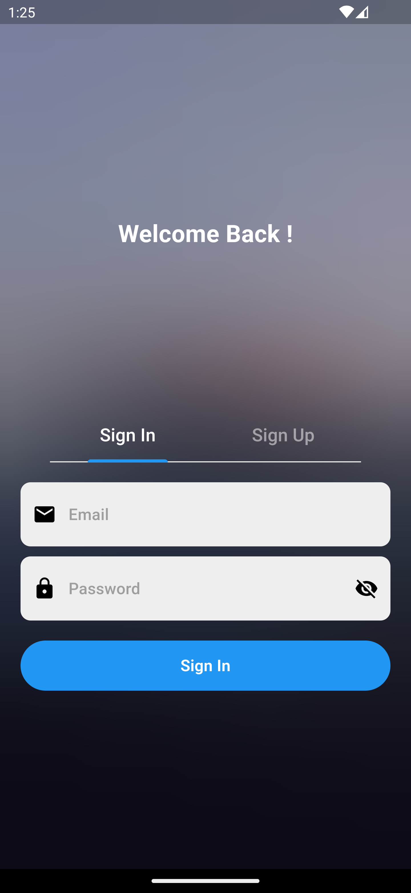

# explore_ez - A Transformative Tour Planning Application

Plan your perfect trip with our app! It's made using Flutter, Firebase, and Google Maps. You'll get a custom route based on your preferences, shown on a map with an efficien route to all the places.

# Installation

### Flutter Installation

1. **Download Flutter:** First, download Flutter SDK from the [official website](https://flutter.dev/docs/get-started/install).
2. **Extract Flutter:** Extract the downloaded ZIP file to a location on your machine.
3. **Set Up PATH:** Add the Flutter `bin` directory to your system's PATH variable.
   For macOS/Linux:
   ```bash
   $ export PATH="$PATH:`pwd`/flutter/bin"
   ```
### Firebase Setup

1. **Install Firebase CLI**: Download and install firebase CLI from the [officical site](https://firebase.google.com/docs/cli#setup_update_cli).
2. **Install npm** : Download and install nodejs from the [official site](https://nodejs.org/en/download)
3. **Install flutterfire**: Refer this docs to get into initializing the firebase project [docs](https://firebase.google.com/docs/flutter/setup)

### Clone the repository

Clone the repository to your local machine:

```bash
$ git clone https://github.com/Prime-Movers/explore_ez.git
$ cd explore_ez
```
You can also fork this repository and use github desktop to clone the forked repository in to your local machine.

### Installing dependencies
Run pub get to get all the dependencies of the flutter application

```bash
$ flutter pub get
```
## Screenshots

| Sign In | Sign Up|
|------|-------|
|||

| Home Screen | Area Selection |
|------|-------|
|||

| Select hotels | Select Places|
|------|-------|
|||

| Review Plan | Generated Plan|
|------|-------|
|||


## Api Integration
Please replace the following placeholders with your respective API keys:

- For Google Maps API, update the `gmapsApi` variable in `model/apikeys.py` and `lib/components/apikey.dart`.
- For Gemini API, update the `geminiApi` variable in `model/apikeys.py`.

## Running the Application

Run Gemini_model which will start a local flask server
```bash
$ cd model
$ python Gemini_model.py
```
Then run main.dart
> ⚠️ **Please note:** Only the android emulators will work with flask local server,if you need to debug on your mobile device try to use ngrok and change the url in `packages\plan_repository\lib\src\model_plan_repo.dart` with the ngrok edge url

## Build Releases
You can get the build apk versions from [releases](https://github.com/Prime-Movers/explore_ez/releases)


